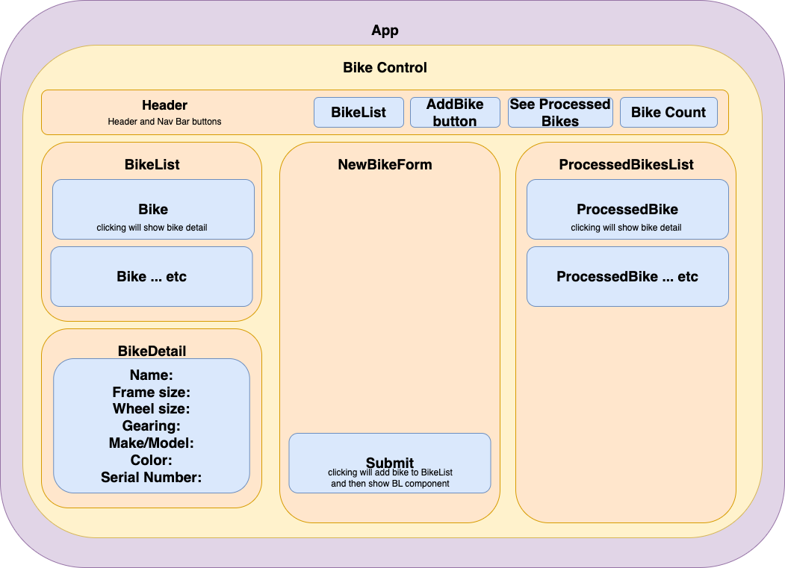
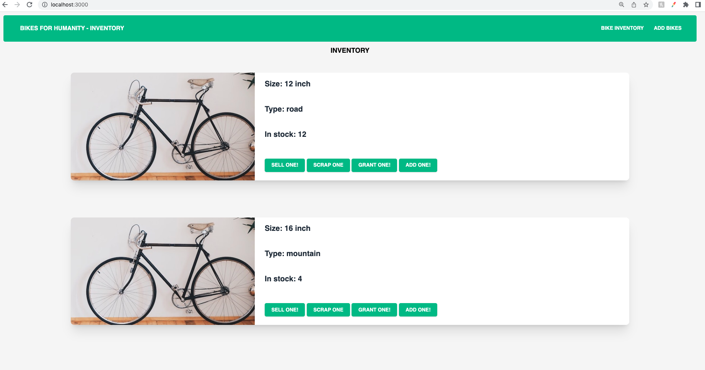
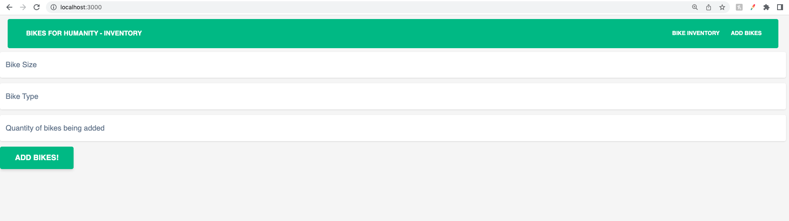

# At our bike shop..
-we sell/grant/scrap multiple sizes and types of bikes
-bikes are donated in sets of 5
-every sale/grant/scrap decrements 1 bike until that size/type is empty

# components diagram

