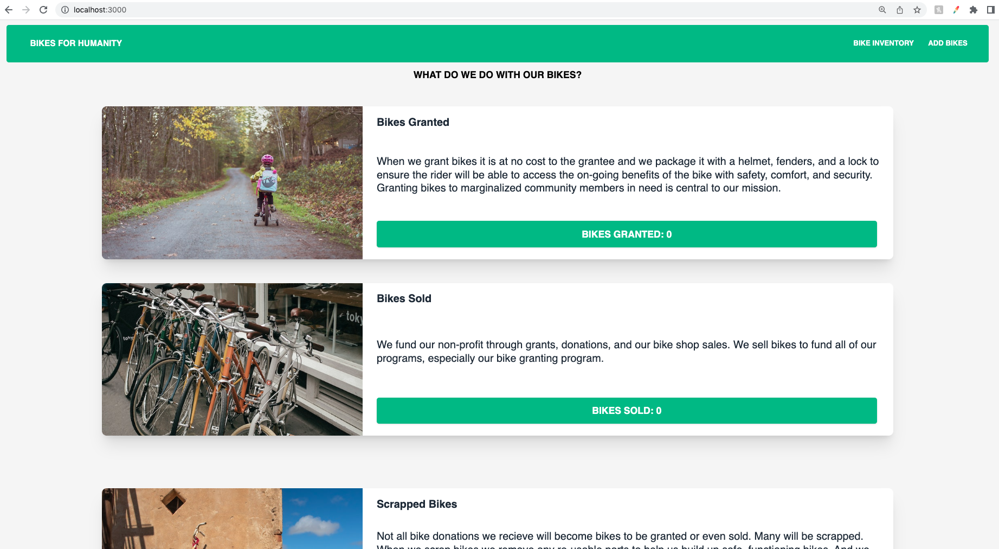
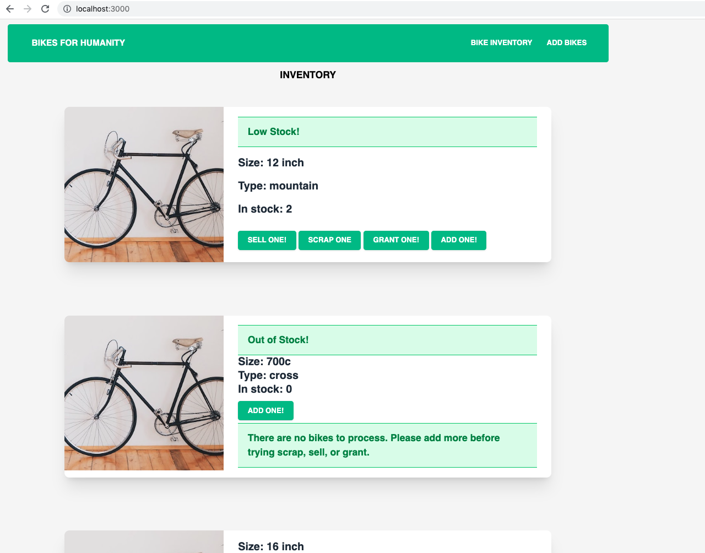

# _Bike Shop Inventory_

#### By _**Patty Otero**_

#### _A React app to track bikeshop bike inventory._

## Technologies Used

* _Javascript_
* _React_
* _Tailwindcss_ 
* _CSS_
* _HTML_

## Description
_A bike shop inventory tracker with full CRUD functionality and tailwindcss styling. Can add bikes by size and type with a form. Then can select bikes to be granted, scrapped, or sold. Stats for how bikes are processed are displayed on a stats page which acts as the landing page and also is availabel when clicking on the "Bikes For Humanity" title in the navigation bar._

# Components Diagram

# Stats Page / Landing Page

# Inventory Page

# Add Bike Form Page

## Setup/Installation Requirements

* Clone this repository to your desktop: `git clone https://github.com/patty-rose/bike-shop.git`
* Open your terminal and navigate to the top of this directory `bike-shop`
* Install dependencies and run app with local host. Run the following commands:
`$npm install`
`$npm run start`
* Use the localhost url with your web-browser to view the site

## Known Bugs

* _dropdown menu icon does not work_

## License

_MIT_

Copyright (c) _2022_ _Patty Otero_